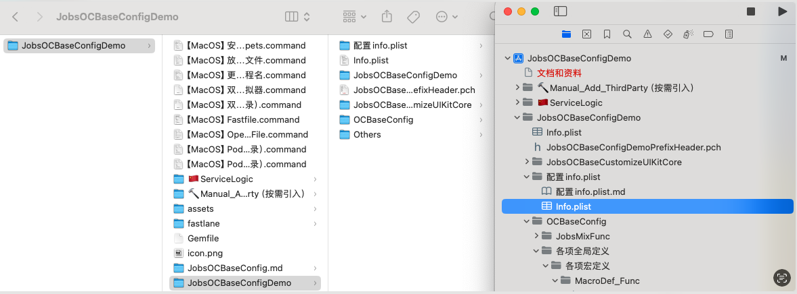

#  ⚙️配置`info.plist`


[toc]
## 一、🔥 <font id=前言>前言</font>

* **`info.plist`不需要包含进项目工程。**系统通过自检（读取指定目录下的指定名的文件）读取

* <font color=red>**如果包含进项目，编译会报错**</font>

* 经实践证明，如果配置多语言化，那么Xcode将会刷新`Info.plist`，<u>导致里面的注释消失</u>。正确的做法是，对`Info.plist`进行备份，随时进行替换

* 工程项目的`Info.plist`文件是对整个工程的配置说明，<u>系统固定读取</u>，所以必须在工程项目根目录的同名文件夹下。否则项目启动会出问题

  

## 二、⚙️ 配置 <a href="#前言" style="font-size:17px; color:green;"><b>🔼</b></a> <a href="#🔚" style="font-size:17px; color:green;"><b>🔽</b></a>

> 以 **`Open As Source Code`** 的方式打开**`info.plist`**

### 2.1、App索取用户权限（兼容处理多语言国际化方案）<a href="#前言" style="font-size:17px; color:green;"><b>🔼</b></a> <a href="#🔚" style="font-size:17px; color:green;"><b>🔽</b></a>

*  <font color=red>**多语言映射文件**</font> ➤ `Localizable.strings(English)`

  ```
  /// 权限设置
  "App需要您的同意，才能访问您的面容识别功能，用于安全验证" = "NSFaceIDUsageDescription";
  "添加曲目到您的音乐库" = "NSAppleMusicUsageDescription";
  "若不允许，你将无法使用联机服务" = "NSBluetoothAlwaysUsageDescription";
  "若不允许，你将无法使用联机服务" = "NSBluetoothPeripheralUsageDescription";
  "若不允许，你将无法使用添加日历功能" = "NSCalendarsUsageDescription";
  "若不允许，你将无法使用拍照功能" = "NSCameraUsageDescription";
  "通讯录信息仅用于查找联系人，并会得到严格保密" = "NSContactsUsageDescription";
  "若不允许，你将无法参与运动排行榜活动" = "NSHealthShareUsageDescription";
  "若不允许，你将无法参与运动排行榜活动" = "NSHealthUpdateUsageDescription";
  "若不允许，你将无法使用智能家居服务" = "NSHomeKitUsageDescription";
  "我们需要获取你的定位权限以供完成查找附近商户功能" = "NSLocationAlwaysAndWhenInUseUsageDescription";
  "我们需要您的同意,您的位置信息将用于查看当前位置信息" = "NSLocationAlwaysUsageDescription";
  "我们需要获取你的定位权限以供完成查找附近商户功能" = "NSLocationWhenInUseUsageDescription";
  "我们需要获取你的麦克风权限以供完成语音搜索功能" = "NSMicrophoneUsageDescription";
  "我们需要获取你的运动权限以完成运动挑战赛功能" = "NSMotionUsageDescription";
  "我们需要获取你的相册权限以完成选择本地图片功能" = "NSPhotoLibraryAddUsageDescription";
  "我们需要获取你的相册权限以完成选择本地图片功能" = "NSPhotoLibraryUsageDescription";
  "我们需要获取你的提醒事项权限以供添加提醒事项" = "NSRemindersUsageDescription";
  "我们需要获取你的Siri权限以方便完成Siri建议功能" = "NSSiriUsageDescription";
  "我们需要获取你的语音识别功能已完成键盘语音识别输入功能" = "NSSpeechRecognitionUsageDescription";
  "我们需要获取你的TV权限" = "NSVideoSubscriberAccountUsageDescription";
  ```

* ```xml
  <key>NSFaceIDUsageDescription</key>
  <string>$(NSFaceIDUsageDescription)</string><!-- App需要您的同意，才能访问您的面容识别功能，用于安全验证 -->
  <key>NSAppleMusicUsageDescription</key>
  <string>$(NSAppleMusicUsageDescription)</string><!-- Add tracks to your music library. -->
  <key>NSBluetoothAlwaysUsageDescription</key>
  <string>$(NSBluetoothAlwaysUsageDescription)</string><!-- 若不允许，你将无法使用联机服务 -->
  <key>NSBluetoothPeripheralUsageDescription</key>
  <string>$(NSBluetoothPeripheralUsageDescription)</string><!-- 若不允许，你将无法使用联机服务 -->
  <key>NSCalendarsUsageDescription</key>
  <string>$(NSCalendarsUsageDescription)</string><!-- 若不允许，你将无法使用添加日历功能 -->
  <key>NSCameraUsageDescription</key>
  <string>$(NSCameraUsageDescription)</string><!-- 若不允许，你将无法使用拍照功能 -->
  <key>NSContactsUsageDescription</key>
  <string>$(NSContactsUsageDescription)</string><!-- 通讯录信息仅用于查找联系人，并会得到严格保密 -->
  <key>NSHealthShareUsageDescription</key>
  <string>$(NSHealthShareUsageDescription)</string><!-- 若不允许，你将无法参与运动排行榜活动 -->
  <key>NSHealthUpdateUsageDescription</key>
  <string>$(NSHealthUpdateUsageDescription)</string><!-- 若不允许，你将无法参与运动排行榜活动 -->
  <key>NSHomeKitUsageDescription</key>
  <string>$(NSHomeKitUsageDescription)</string><!-- 若不允许，你将无法使用智能家居服务 -->
  <key>NSLocationAlwaysAndWhenInUseUsageDescription</key>
  <string>$(NSLocationAlwaysAndWhenInUseUsageDescription)</string><!-- 我们需要获取你的定位权限以供完成查找附近商户功能 -->
  <key>NSLocationAlwaysUsageDescription</key>
  <string>$(NSLocationAlwaysUsageDescription)</string><!-- 我们需要您的同意,您的位置信息将用于查看当前位置信息 -->
  <key>NSLocationWhenInUseUsageDescription</key>
  <string>$(NSLocationWhenInUseUsageDescription)</string><!-- 我们需要获取你的定位权限以供完成查找附近商户功能 -->
  <key>NSMicrophoneUsageDescription</key>
  <string>$(NSMicrophoneUsageDescription)</string><!-- 我们需要获取你的麦克风权限以供完成语音搜索功能 -->
  <key>NSMotionUsageDescription</key>
  <string>$(NSMotionUsageDescription)</string><!-- 我们需要获取你的运动权限以完成运动挑战赛功能 -->
  <key>NSPhotoLibraryAddUsageDescription</key>
  <string>$(NSPhotoLibraryAddUsageDescription)</string><!-- 我们需要获取你的相册权限以完成选择本地图片功能 -->
  <key>NSPhotoLibraryUsageDescription</key>
  <string>$(NSPhotoLibraryUsageDescription)</string><!-- 我们需要获取你的相册权限以完成选择本地图片功能 -->
  <key>NSRemindersUsageDescription</key>
  <string>$(NSRemindersUsageDescription)</string><!-- 我们需要获取你的提醒事项权限以供添加提醒事项 -->
  <key>NSSiriUsageDescription</key>
  <string>$(NSSiriUsageDescription)</string><!-- 我们需要获取你的Siri权限以方便完成Siri建议功能 -->
  <key>NSSpeechRecognitionUsageDescription</key>
  <string>$(NSSpeechRecognitionUsageDescription)</string><!-- 我们需要获取你的语音识别功能已完成键盘语音识别输入功能 -->
  <key>NSVideoSubscriberAccountUsageDescription</key>
  <string>$(NSVideoSubscriberAccountUsageDescription)</string><!-- 我们需要获取你的TV权限 -->
  ```

### 2.2、App多语言化 <a href="#前言" style="font-size:17px; color:green;"><b>🔼</b></a> <a href="#🔚" style="font-size:17px; color:green;"><b>🔽</b></a>

```xml
<!-- 用于指定应用程序的显示名称是否本地化 -->
<key>LSHasLocalizedDisplayName</key>
<true/>
<!-- 应用支持的所有语言代码，这些语言代码应该与您的本地化资源文件夹相匹配 -->
<key>CFBundleLocalizations</key>
<array>
    <string>en</string>
    <string>zh-Hans</string>
    <string>fil-PH</string>
</array>
<!-- 开发区域的语言代码 -->
<key>CFBundleDevelopmentRegion</key>
<string>en</string>
```

### 2.3、App添加外部字体 <a href="#前言" style="font-size:17px; color:green;"><b>🔼</b></a> <a href="#🔚" style="font-size:17px; color:green;"><b>🔽</b></a>

* 需要把外部字体包含进工程项目里面

  ```xml
  <key>UIAppFonts</key>
  <array>
      <string>时尚中黑简体.ttf</string>
      <string>锐字锐线怒放黑简.ttf</string>
  </array>
  ```

### 2.4、App白名单 <a href="#前言" style="font-size:17px; color:green;"><b>🔼</b></a> <a href="#🔚" style="font-size:17px; color:green;"><b>🔽</b></a>

* **iOS 9**系统策略更新，限制了**http**协议的访问，此外应用需要在`Info.plist`中将要使用的**URL Schemes**列为白名单，才可正常检查其他应用是否安装。

* 当你的应用在**iOS 9**中需要使用 QQ/QQ空间/支付宝/微信SDK 的相关能力（分享、收藏、支付、登录等）时，需要在`Info.plist`里相应的增加如下代码：

  ```xml
  <key>LSApplicationQueriesSchemes</key>
   <array>
      <!-- 微信 URL Scheme 白名单-->
      <string>wechat</string>
      <string>weixin</string>
      <!-- 新浪微博 URL Scheme 白名单-->
      <string>sinaweibohd</string>
      <string>sinaweibo</string>
      <string>sinaweibosso</string>
      <string>weibosdk</string>
      <string>weibosdk2.5</string>
      <!-- QQ、Qzone URL Scheme 白名单-->
      <string>mqqapi</string>
      <string>mqq</string>
      <string>mqqOpensdkSSoLogin</string>
      <string>mqqconnect</string>
      <string>mqqopensdkdataline</string>
      <string>mqqopensdkgrouptribeshare</string>
      <string>mqqopensdkfriend</string>
      <string>mqqopensdkapi</string>
      <string>mqqopensdkapiV2</string>
      <string>mqqopensdkapiV3</string>
      <string>mqzoneopensdk</string>
      <string>wtloginmqq</string>
      <string>wtloginmqq2</string>
      <string>mqqwpa</string>
      <string>mqzone</string>
      <string>mqzonev2</string>
      <string>mqzoneshare</string>
      <string>wtloginqzone</string>
      <string>mqzonewx</string>
      <string>mqzoneopensdkapiV2</string>
      <string>mqzoneopensdkapi19</string>
      <string>mqzoneopensdkapi</string>
      <string>mqzoneopensdk</string>
      <!-- 支付宝  URL Scheme 白名单-->
      <string>alipay</string>
      <string>alipayshare</string>
  </array>
  ```

### 2.5、App屏幕旋转 <a href="#前言" style="font-size:17px; color:green;"><b>🔼</b></a> <a href="#🔚" style="font-size:17px; color:green;"><b>🔽</b></a>

```xml
<key>UISupportedInterfaceOrientations</key>
<array>
    <string>UIInterfaceOrientationPortrait</string>
    <string>UIInterfaceOrientationPortraitUpsideDown</string>
    <string>UIInterfaceOrientationLandscapeLeft</string>
    <string>UIInterfaceOrientationLandscapeRight</string>
</array>
```

### 2.6、iOS 横竖屏UI切换 <a href="#前言" style="font-size:17px; color:green;"><b>🔼</b></a> <a href="#🔚" style="font-size:17px; color:green;"><b>🔽</b></a>

* **iPhone** 应用

  ```xml
  <key>UISupportedInterfaceOrientations</key>
  <array>
      <string>UIInterfaceOrientationPortrait</string>
      <string>UIInterfaceOrientationPortraitUpsideDown</string>
      <string>UIInterfaceOrientationLandscapeLeft</string>
      <string>UIInterfaceOrientationLandscapeRight</string>
  </array>
  ```

* **iPad** 应用

  ```xml
  <key>UISupportedInterfaceOrientations~ipad</key>
  <array>
      <string>UIInterfaceOrientationPortrait</string>
      <string>UIInterfaceOrientationPortraitUpsideDown</string>
      <string>UIInterfaceOrientationLandscapeLeft</string>
      <string>UIInterfaceOrientationLandscapeRight</string>
  </array>
  ```

### 2.7、App添加`Appicon` <a href="#前言" style="font-size:17px; color:green;"><b>🔼</b></a> <a href="#🔚" style="font-size:17px; color:green;"><b>🔽</b></a>

```xml
<key>CFBundleIcons</key>
<dict>
    <key>CFBundleAlternateIcons</key>
    <dict>
        <key>晴</key>
        <dict>
            <key>CFBundleIconFiles</key>
            <array>
                <string>晴</string>
            </array>
            <key>UIPrerenderedIcon</key>
            <false/>
        </dict>
        <key>多云</key>
        <dict>
            <key>CFBundleIconFiles</key>
            <array>
                <string>多云</string>
            </array>
            <key>UIPrerenderedIcon</key>
            <false/>
        </dict>
        <key>小雨</key>
        <dict>
            <key>CFBundleIconFiles</key>
            <array>
                <string>小雨</string>
            </array>
            <key>UIPrerenderedIcon</key>
            <false/>
        </dict>
        <key>大雨</key>
        <dict>
            <key>CFBundleIconFiles</key>
            <array>
                <string>大雨</string>
            </array>
            <key>UIPrerenderedIcon</key>
            <false/>
        </dict>
        <key>雪</key>
        <dict>
            <key>CFBundleIconFiles</key>
            <array>
                <string>雪</string>
            </array>
            <key>UIPrerenderedIcon</key>
            <false/>
        </dict>
    </dict>
    <key>UINewsstandIcon</key>
    <dict>
        <key>CFBundleIconFiles</key>
        <array>
            <string></string>
        </array>
        <key>UINewsstandBindingEdge</key>
        <string>UINewsstandBindingEdgeLeft</string>
        <key>UINewsstandBindingType</key>
        <string>UINewsstandBindingTypeMagazine</string>
    </dict>
</dict>
```

### 2.8、iOS 状态栏修改 <a href="#前言" style="font-size:17px; color:green;"><b>🔼</b></a> <a href="#🔚" style="font-size:17px; color:green;"><b>🔽</b></a>

```xml
<!-- iOS 状态栏颜色的修改【全局设置 全局是NO、局部是YES】View controller-based status bar appearance : NO-->
<key>UIViewControllerBasedStatusBarAppearance</key>
<false/>
<!-- iOS 状态栏颜色的修改【全局设置】Status bar style : Light Content-->
<key>UIStatusBarStyle</key>
<string>UIStatusBarStyleLightContent</string>
<!--只设置UIViewControllerBasedStatusBarAppearance为false，而不设置UIStatusBarHidden为true，在某些情况下会显示本应该隐藏的iOS状态栏-->
<key>UIStatusBarHidden</key>
<true/>
```

### 2.9、App名 <a href="#前言" style="font-size:17px; color:green;"><b>🔼</b></a> <a href="#🔚" style="font-size:17px; color:green;"><b>🔽</b></a>

```xml
<!-- 是应用程序的唯一标识符，通常以反转的域名格式（例如：com.example.MyApp）表示。-->
<!-- Products文件夹下打包的App的名字将会命名为${CFBundleDisplayName}.app-->
<key>CFBundleIdentifier</key>
<string></string>
<!-- 应用程序的显示名称。会显示在设备的主屏幕上以及应用程序内的标题栏等位置-->
<!-- 可以是应用程序的短名称，用于显示给用户，不需要是全名-->
<!-- Products文件夹下打包的App的名字将会命名为${CFBundleDisplayName}.app-->
<key>CFBundleName</key>
<string>CFBundleDisplayName</string>
<!-- 应用程序的显示名称，用于在设备的主屏幕上显示。-->
<!-- Products文件夹下打包的App的名字将会命名为${工程项目名}.app-->
<key>CFBundleDisplayName</key>
<string>CFBundleDisplayName</string>
```

### 2.10、App多场景的支持 <a href="#前言" style="font-size:17px; color:green;"><b>🔼</b></a> <a href="#🔚" style="font-size:17px; color:green;"><b>🔽</b></a>

```xml
<!--❤️【UIApplicationSceneManifest】iOS 13 开始引入。支持多窗口应用程序，允许用户在 iPad 和 macOS 上运行多个实例的应用程序❤️-->
<key>UIApplicationSceneManifest</key>
<dict>
    <!--【UIApplicationSupportsMultipleScenes】指示应用程序是否支持多场景（多窗口）。设置为 YES 表示支持多场景 -->
    <key>UIApplicationSupportsMultipleScenes</key>
    <false/>
    <!-- 【UISceneConfigurations】定义不同场景的配置，包括每种场景的生命周期管理类和初始场景配置 -->
    <key>UISceneConfigurations</key>
    <dict>
        <!-- 【UIWindowSceneSessionRoleApplication】在 iOS 的多窗口场景管理中，角色定义了场景的用途或类型。表示该场景是应用的主要窗口场景。 -->
        <key>UIWindowSceneSessionRoleApplication</key>
        <array>
            <dict>
                <!--【UISceneConfigurationName】指定了一个场景配置的名称，iOS 会使用这个名称来查找和加载相应的场景配置 -->
                <key>UISceneConfigurationName</key>
                <string>Default Configuration</string>
                <!--【UISceneDelegateClassName】用于指明哪个类将处理特定场景的生命周期事件 -->
                <key>UISceneDelegateClassName</key>
                <string>SceneDelegate</string>
                <!--【UISceneStoryboardFile】用来定义应用启动时应该加载的特定 Storyboard 文件 -->
                <key>UISceneStoryboardFile</key>
                <string>Main</string>
            </dict>
        </array>
    </dict>
</dict>
```

### 2.11、`WKWebKit` 相关 <a href="#前言" style="font-size:17px; color:green;"><b>🔼</b></a> <a href="#🔚" style="font-size:17px; color:green;"><b>🔽</b></a>

```xml
<!--允许加载外部资源-->
<key>NSAppTransportSecurity</key>
<dict>
    <key>NSAllowsArbitraryLoads</key>
    <true/>
    <key>NSExceptionDomains</key>
    <dict>
        <key>livechatinc.com</key>
        <dict>
            <key>NSIncludesSubdomains</key>
            <true/>
            <key>NSExceptionAllowsInsecureHTTPLoads</key>
            <true/>
            <key>NSExceptionMinimumTLSVersion</key>
            <string>TLSv1.2</string>
            <key>NSExceptionRequiresForwardSecrecy</key>
            <false/>
        </dict>
    </dict>
</dict>
<key>NSNetworkLogsEnabled</key>
<true/>
```

### 2.12、给 `Info.plist` 里的文案做本地化 <a href="#前言" style="font-size:17px; color:green;"><b>🔼</b></a> <a href="#🔚" style="font-size:17px; color:green;"><b>🔽</b></a>

* ```xml
  <?xml version="1.0" encoding="UTF-8"?>
  <!DOCTYPE plist PUBLIC "-//Apple//DTD PLIST 1.0//EN" "http://www.apple.com/DTDs/PropertyList-1.0.dtd">
  <plist version="1.0">
  <dict>
  
      <key>UIApplicationSceneManifest</key>
      <dict>
          <key>UIApplicationSupportsMultipleScenes</key>
          <false/>
          <key>UISceneConfigurations</key>
          <dict>
              <key>UIWindowSceneSessionRoleApplication</key>
              <array>
                  <dict>
                      <key>UISceneConfigurationName</key>
                      <string>Default Configuration</string>
                      <key>UISceneDelegateClassName</key>
                      <string>$(PRODUCT_MODULE_NAME).SceneDelegate</string>
                      <key>UISceneStoryboardFile</key>
                      <string>Main</string>
                  </dict>
              </array>
          </dict>
      </dict>
  
      <key>NSAppTransportSecurity</key>
      <dict>
        <!-- ATS 配置：仅放开 WebView 内容的任意加载，其他网络请求仍受 ATS 约束 -->
        <key>NSAllowsArbitraryLoadsInWebContent</key>
        <true/>
      </dict>
  
      <!-- 适配 iOS 16+ 的 UI 兼容开关，不是隐私权限 -->
      <key>UIDesignRequiresCompatibility</key>
      <true/>
  
      <!-- ====== 相机 / 麦克风 / 相册 ====== -->
  
      <!-- 相机权限：用于拍照、扫码、视频录制等需要调用摄像头的场景 -->
      <key>NSCameraUsageDescription</key>
      <string>NSCameraUsageDescription</string>
  
      <!-- 麦克风权限：用于录音、视频通话、语音消息等需要采集声音的场景 -->
      <key>NSMicrophoneUsageDescription</key>
      <string>NSMicrophoneUsageDescription</string>
  
      <!-- 相册读取权限：从系统相册中选择、读取照片或视频 -->
      <key>NSPhotoLibraryUsageDescription</key>
      <string>NSPhotoLibraryUsageDescription</string>
  
      <!-- 相册写入权限：将拍摄或编辑后的图片/视频保存到系统相册 -->
      <key>NSPhotoLibraryAddUsageDescription</key>
      <string>NSPhotoLibraryAddUsageDescription</string>
  
      <!-- ====== 定位（使用期间 / 始终 / 临时精确） ====== -->
  
      <!-- 仅“使用期间”定位：App 在前台使用时访问位置信息（常见导航、附近服务） -->
      <key>NSLocationWhenInUseUsageDescription</key>
      <string>NSLocationWhenInUseUsageDescription</string>
  
      <!-- 始终 + 使用期间定位：前台 + 后台都可访问位置信息（持续导航、地理围栏） -->
      <key>NSLocationAlwaysAndWhenInUseUsageDescription</key>
      <string>NSLocationAlwaysAndWhenInUseUsageDescription</string>
  
      <!-- 旧系统兼容的“始终定位”描述，和上面的键配合使用 -->
      <key>NSLocationAlwaysUsageDescription</key>
      <string>NSLocationAlwaysUsageDescription</string>
  
      <!-- iOS 14+ 临时“精确定位”用途声明，需要详细说明每个用途场景 -->
  
      <!-- 精确导航：比如驾车/步行导航时需要高精度定位 -->
      <key>NSLocationTemporaryUsageDescriptionDictionary</key>
      <dict>
          <key>NavigationPrecise</key>
          <string>NavigationPrecise</string>
  
          <!-- 附近搜索：查找周边服务、设备、门店等 -->
          <key>NearbySearch</key>
          <string>NearbySearch</string>
  
          <!-- AR 锚点：在增强现实场景中进行精确定位和放置锚点 -->
          <key>ARAnchors</key>
          <string>ARAnchors</string>
      </dict>
  
      <!-- ====== 蓝牙（旧/新） ====== -->
  
      <!-- 始终蓝牙权限：App 在前台或后台都可与蓝牙设备交互 -->
      <key>NSBluetoothAlwaysUsageDescription</key>
      <string>NSBluetoothAlwaysUsageDescription</string>
  
      <!-- 旧键：蓝牙外设权限，用于发现/连接/通信附近的蓝牙设备 -->
      <key>NSBluetoothPeripheralUsageDescription</key>
      <string>NSBluetoothPeripheralUsageDescription</string>
  
      <!-- ====== 通讯录 / 日历 / 提醒事项 ====== -->
  
      <!-- 通讯录权限：读取联系人用于选择联系人、自动填充等 -->
      <key>NSContactsUsageDescription</key>
      <string>NSContactsUsageDescription</string>
  
      <!-- 日历基础权限：读取/写入日历事件（旧键，兼容性用途） -->
      <key>NSCalendarsUsageDescription</key>
      <string>NSCalendarsUsageDescription</string>
  
      <!-- iOS 17+ 日历“完全访问”：可读、可写、可修改所有日历事件 -->
      <key>NSCalendarsFullAccessUsageDescription</key>
      <string>NSCalendarsFullAccessUsageDescription</string>
  
      <!-- iOS 17+ 日历“仅写入”：只能往日历里添加事件，不能读取已有事件 -->
      <key>NSCalendarsWriteOnlyAccessUsageDescription</key>
      <string>NSCalendarsWriteOnlyAccessUsageDescription</string>
  
      <!-- 提醒事项基础权限：读取/创建提醒（旧键，兼容性用途） -->
      <key>NSRemindersUsageDescription</key>
      <string>NSRemindersUsageDescription</string>
  
      <!-- iOS 17+ 提醒事项“完全访问”：读、写、改所有待办/提醒 -->
      <key>NSRemindersFullAccessUsageDescription</key>
      <string>NSRemindersFullAccessUsageDescription</string>
  
      <!-- iOS 17+ 提醒事项“仅写入”：只能添加新的待办，不读取已有记录 -->
      <key>NSRemindersWriteOnlyAccessUsageDescription</key>
      <string>NSRemindersWriteOnlyAccessUsageDescription</string>
  
      <!-- ====== 健康 / 运动与健身（HealthKit） ====== -->
  
      <!-- 健康数据读取权限：从 HealthKit 读取健康/体征/运动数据 -->
      <key>NSHealthShareUsageDescription</key>
      <string>NSHealthShareUsageDescription</string>
  
      <!-- 健康数据写入权限：向 HealthKit 写入运动记录、健康指标等 -->
      <key>NSHealthUpdateUsageDescription</key>
      <string>NSHealthUpdateUsageDescription</string>
  
      <!-- 临床健康档案读取：访问医院/诊所等来源的临床健康记录 -->
      <key>NSHealthClinicalHealthRecordsShareUsageDescription</key>
      <string>NSHealthClinicalHealthRecordsShareUsageDescription</string>
  
      <!-- 运动与健身权限：访问加速度计、步数等运动数据 -->
      <key>NSMotionUsageDescription</key>
      <string>NSMotionUsageDescription</string>
  
      <!-- ====== 语音 / Siri / Face ID ====== -->
  
      <!-- 语音识别权限：将语音实时转成文字（非录音本身） -->
      <key>NSSpeechRecognitionUsageDescription</key>
      <string>NSSpeechRecognitionUsageDescription</string>
  
      <!-- Siri 权限：使用 Siri 执行语音指令、快捷指令 -->
      <key>NSSiriUsageDescription</key>
      <string>NSSiriUsageDescription</string>
  
      <!-- Face ID 权限：用面容识别进行登录、支付或敏感操作验证 -->
      <key>NSFaceIDUsageDescription</key>
      <string>NSFaceIDUsageDescription</string>
  
      <!-- ====== 家庭(HomeKit) / 本地网络 / Bonjour ====== -->
  
      <!-- HomeKit 权限：控制和管理智能家居设备（灯、门锁等） -->
      <key>NSHomeKitUsageDescription</key>
      <string>NSHomeKitUsageDescription</string>
  
      <!-- 本地网络权限：在局域网中发现并连接其它设备或服务 -->
      <key>NSLocalNetworkUsageDescription</key>
      <string>NSLocalNetworkUsageDescription</string>
  
      <!-- Bonjour 服务列表：声明需要发现的局域网服务类型 -->
      <key>NSBonjourServices</key>
      <array>
          <!-- 按需添加你真实使用的服务类型；下面是示例 -->
          <string>_http._tcp.</string>
          <string>_airplay._tcp.</string>
          <string>_yourservice._tcp.</string>
      </array>
  
      <!-- ====== NFC ====== -->
  
      <!-- NFC 权限：读取 NFC 标签或与支持 NFC 的设备交互 -->
      <key>NFCReaderUsageDescription</key>
      <string>NFCReaderUsageDescription</string>
  
      <!-- ====== Apple Music / 媒体库 ====== -->
  
      <!-- 媒体库权限：访问系统音乐库，读取/播放音乐 -->
      <key>NSAppleMusicUsageDescription</key>
      <string>NSAppleMusicUsageDescription</string>
  
      <!-- ====== 广告跟踪（ATT） ====== -->
  
      <!-- App Tracking 权限：用于跨 App / 网站的广告归因与个性化推荐 -->
      <key>NSUserTrackingUsageDescription</key>
      <string>NSUserTrackingUsageDescription</string>
  
      <!-- ====== Nearby Interaction（U1/超宽带） ====== -->
  
      <!-- 近距离交互权限：利用 UWB/超宽带进行超近距离定位与设备协同 -->
      <key>NSNearbyInteractionUsageDescription</key>
      <string>NSNearbyInteractionUsageDescription</string>
  
      <!-- ====== TV Provider（视频订阅账户） ====== -->
  
      <!-- 电视供应商账户权限：验证用户订阅，用于播放付费频道/视频 -->
      <key>NSVideoSubscriberAccountUsageDescription</key>
      <string>NSVideoSubscriberAccountUsageDescription</string>
  
      <!-- ====== 关键提醒（Critical Alerts，需要特权能力） ====== -->
  
      <!-- 关键提醒权限：在静音/勿扰模式下仍可发出高优先级通知 -->
      <key>NSCriticalAlertsUsageDescription</key>
      <string>NSCriticalAlertsUsageDescription</string>
  
      <!-- ====== 专注状态共享（Focus Status） ====== -->
  
      <!-- 读取专注状态：根据当前专注模式调整通知/消息的发送时机 -->
      <key>NSFocusStatusUsageDescription</key>
      <string>NSFocusStatusUsageDescription</string>
  
      <!-- ====== 暴露通知（Exposure Notification，需要特权能力） ====== -->
  
      <!-- 暴露通知权限：用于疫情等场景下的接触风险提醒（需官方授权） -->
      <key>NSExposureNotificationUsageDescription</key>
      <string>NSExposureNotificationUsageDescription</string>
  
  </dict>
  </plist>
  ```

* `InfoPlist.strings (Chinese, Simplified)`

  ```xml
  /* 
    InfoPlist.strings (Chinese, Simplified)
    JobsSwiftBaseConfigDemo
  
    Created by Jobs on 11/17/25.
    
  */
  
  /* ====== 相机 / 麦克风 / 相册 ====== */
  "NSCameraUsageDescription" = "需要访问相机用于拍摄照片或视频。";
  "NSMicrophoneUsageDescription" = "需要访问麦克风用于录音或视频录制。";
  "NSPhotoLibraryUsageDescription" = "需要访问相册以选择和读取您的照片与视频。";
  "NSPhotoLibraryAddUsageDescription" = "需要写入相册以保存您拍摄或编辑的图片/视频。";
  
  /* ====== 定位（使用期间 / 始终 / 临时精确） ====== */
  "NSLocationWhenInUseUsageDescription" = "为提供与位置相关的服务，需要在您使用 App 期间访问位置信息。";
  "NSLocationAlwaysAndWhenInUseUsageDescription" = "为实现持续定位（导航/地理围栏等），需要在前台与后台访问位置信息。";
  "NSLocationAlwaysUsageDescription" = "需要在前台与后台访问位置信息以提供完整定位服务。";
  
  /* iOS 14+ 临时“精确定位”用途声明 */
  "NavigationPrecise" = "用于精确导航与路线规划。";
  "NearbySearch" = "用于查找附近的服务与设备。";
  "ARAnchors" = "用于增强现实场景的精确定位与锚点。";
  
  /* ====== 蓝牙（旧/新） ====== */
  "NSBluetoothAlwaysUsageDescription" = "需要使用蓝牙以连接或管理附近的设备。";
  "NSBluetoothPeripheralUsageDescription" = "需要使用蓝牙以发现、连接或与周边设备通信。";
  
  /* ====== 通讯录 / 日历 / 提醒事项 ====== */
  "NSContactsUsageDescription" = "需要访问通讯录以选择联系人或自动填充信息。";
  
  "NSCalendarsUsageDescription" = "需要访问日历以读取或写入您的日程。";
  "NSCalendarsFullAccessUsageDescription" = "需要完整访问您的日历以读取、创建与修改日程。";
  "NSCalendarsWriteOnlyAccessUsageDescription" = "需要向您的日历添加事件（仅写入，不读取已有事件）。";
  
  "NSRemindersUsageDescription" = "需要访问提醒事项以读取或创建待办。";
  "NSRemindersFullAccessUsageDescription" = "需要完整访问提醒事项以读取、创建与修改待办。";
  "NSRemindersWriteOnlyAccessUsageDescription" = "需要向提醒事项添加待办（仅写入，不读取已有待办）。";
  
  /* ====== 健康 / 运动与健身 ====== */
  "NSHealthShareUsageDescription" = "需要读取健康数据以提供健康相关功能与分析。";
  "NSHealthUpdateUsageDescription" = "需要写入健康数据以记录您的运动或体征。";
  "NSHealthClinicalHealthRecordsShareUsageDescription" = "需要读取您的临床健康记录以提供相关服务与建议。";
  "NSMotionUsageDescription" = "需要访问运动与健身数据（加速度计/步数）以统计与分析活动。";
  
  /* ====== 语音 / Siri / Face ID ====== */
  "NSSpeechRecognitionUsageDescription" = "需要进行语音识别以将您的语音转换为文本。";
  "NSSiriUsageDescription" = "需要使用 Siri 以执行语音指令或快捷操作。";
  "NSFaceIDUsageDescription" = "需要使用 Face ID 以快速完成安全验证。";
  
  /* ====== 家庭(HomeKit) / 本地网络 / Bonjour ====== */
  "NSHomeKitUsageDescription" = "需要访问家庭数据以控制或管理您的家庭设备。";
  "NSLocalNetworkUsageDescription" = "需要访问本地网络以发现和连接局域网中的设备或服务。";
  
  /* ====== NFC ====== */
  "NFCReaderUsageDescription" = "需要使用 NFC 以读取或交互支持的近场标签/设备。";
  
  /* ====== Apple Music / 媒体库 ====== */
  "NSAppleMusicUsageDescription" = "需要访问您的媒体库以读取或播放音乐。";
  
  /* ====== 广告跟踪（ATT） ====== */
  "NSUserTrackingUsageDescription" = "为提供更个性化的内容与广告体验，需要请求跟踪权限；我们不会滥用您的隐私。";
  
  /* ====== Nearby Interaction（U1/超宽带） ====== */
  "NSNearbyInteractionUsageDescription" = "需要使用近距离交互以实现超近距定位与设备交互。";
  
  /* ====== TV Provider（视频订阅账户） ====== */
  "NSVideoSubscriberAccountUsageDescription" = "需要访问您的电视供应商账户以验证订阅并播放内容。";
  
  /* ====== 关键提醒（Critical Alerts） ====== */
  "NSCriticalAlertsUsageDescription" = "需要发送关键提醒以在静音或勿扰模式下也能通知重要事件。";
  
  /* ====== 专注状态共享（Focus Status） ====== */
  "NSFocusStatusUsageDescription" = "需要读取您的专注状态以在合适的时机发送通知或消息。";
  
  /* ====== 暴露通知（Exposure Notification） ====== */
  "NSExposureNotificationUsageDescription" = "需要使用暴露通知以提醒可能的接触风险（仅在获得授权的地区与用途下启用）。";
  ```

* `InfoPlist.strings (English)`

  ```
  /* 
    InfoPlist.strings (English)
    JobsSwiftBaseConfigDemo
  
    Created by Jobs on 11/17/25.
    
  */
  
  /* ====== Camera / Microphone / Photo Library ====== */
  "NSCameraUsageDescription" = "This app requires access to the camera to take photos and record videos.";
  "NSMicrophoneUsageDescription" = "This app requires access to the microphone to record audio and videos.";
  "NSPhotoLibraryUsageDescription" = "This app requires access to your photo library to select and read your photos and videos.";
  "NSPhotoLibraryAddUsageDescription" = "This app requires permission to save photos and videos to your photo library.";
  
  /* ====== Location (When In Use / Always / Temporary Precise) ====== */
  "NSLocationWhenInUseUsageDescription" = "To provide location-based services, this app needs access to your location while you are using it.";
  "NSLocationAlwaysAndWhenInUseUsageDescription" = "To support continuous location features (navigation, geofencing, etc.), this app needs access to your location in the foreground and background.";
  "NSLocationAlwaysUsageDescription" = "This app needs access to your location in the foreground and background to provide full location services.";
  
  /* iOS 14+ temporary precise location reasons */
  "NavigationPrecise" = "Used for precise navigation and route planning.";
  "NearbySearch" = "Used to find nearby services and devices.";
  "ARAnchors" = "Used for precise positioning and anchors in augmented reality experiences.";
  
  /* ====== Bluetooth ====== */
  "NSBluetoothAlwaysUsageDescription" = "This app needs Bluetooth access to connect to and manage nearby devices.";
  "NSBluetoothPeripheralUsageDescription" = "This app needs Bluetooth access to discover, connect to, and communicate with nearby devices.";
  
  /* ====== Contacts / Calendars / Reminders ====== */
  "NSContactsUsageDescription" = "This app needs access to your contacts to select people or autofill their information.";
  
  "NSCalendarsUsageDescription" = "This app needs access to your calendars to read and write your events.";
  "NSCalendarsFullAccessUsageDescription" = "This app needs full access to your calendars to read, create, and edit your events.";
  "NSCalendarsWriteOnlyAccessUsageDescription" = "This app needs permission to add events to your calendars (write-only, without reading existing events).";
  
  "NSRemindersUsageDescription" = "This app needs access to your reminders to read and create tasks.";
  "NSRemindersFullAccessUsageDescription" = "This app needs full access to your reminders to read, create, and edit tasks.";
  "NSRemindersWriteOnlyAccessUsageDescription" = "This app needs permission to add tasks to your reminders (write-only, without reading existing tasks).";
  
  /* ====== Health / Motion & Fitness ====== */
  "NSHealthShareUsageDescription" = "This app needs to read your health data to provide health-related features and analysis.";
  "NSHealthUpdateUsageDescription" = "This app needs to write health data to log your activities and vital signs.";
  "NSHealthClinicalHealthRecordsShareUsageDescription" = "This app needs to read your clinical health records to provide related services and suggestions.";
  "NSMotionUsageDescription" = "This app needs access to motion and fitness data (accelerometer, step count, etc.) to track and analyze your activity.";
  
  /* ====== Speech / Siri / Face ID ====== */
  "NSSpeechRecognitionUsageDescription" = "This app needs speech recognition to convert your voice into text.";
  "NSSiriUsageDescription" = "This app uses Siri to perform voice commands and shortcuts.";
  "NSFaceIDUsageDescription" = "This app uses Face ID to quickly and securely verify your identity.";
  
  /* ====== HomeKit / Local Network / Bonjour ====== */
  "NSHomeKitUsageDescription" = "This app needs access to your home data to control and manage your HomeKit devices.";
  "NSLocalNetworkUsageDescription" = "This app needs access to your local network to discover and connect to devices or services on your LAN.";
  
  /* ====== NFC ====== */
  "NFCReaderUsageDescription" = "This app needs to use NFC to read and interact with supported nearby tags and devices.";
  
  /* ====== Apple Music / Media Library ====== */
  "NSAppleMusicUsageDescription" = "This app needs access to your media library to read and play your music.";
  
  /* ====== App Tracking Transparency (ATT) ====== */
  "NSUserTrackingUsageDescription" = "To provide more personalized content and ads, this app requests permission to track your activity; your privacy will not be misused.";
  
  /* ====== Nearby Interaction ====== */
  "NSNearbyInteractionUsageDescription" = "This app needs Nearby Interaction to enable ultra-short-range positioning and device interactions.";
  
  /* ====== TV Provider (Video Subscriber Account) ====== */
  "NSVideoSubscriberAccountUsageDescription" = "This app needs access to your TV provider account to verify your subscription and play content.";
  
  /* ====== Critical Alerts ====== */
  "NSCriticalAlertsUsageDescription" = "This app needs to send critical alerts so important events can be notified even in Silent or Do Not Disturb mode.";
  
  /* ====== Focus Status ====== */
  "NSFocusStatusUsageDescription" = "This app needs to read your Focus status so it can send notifications and messages at appropriate times.";
  
  /* ====== Exposure Notification ====== */
  "NSExposureNotificationUsageDescription" = "This app needs Exposure Notifications to alert you to possible contact risks (enabled only where authorized).";
  ```

### 2.13、其他 <a href="#前言" style="font-size:17px; color:green;"><b>🔼</b></a> <a href="#🔚" style="font-size:17px; color:green;"><b>🔽</b></a>

* ```xml
  <!-- 配置 UILaunchStoryboardName，项目里面就必须将 Main.storyboard 包含到工程，进入编译期-->
  <key>UILaunchStoryboardName</key>
  <string>LaunchScreen</string>
  ```

* ```xml
  <!-- 应用程序是否需要持久的 Wi-Fi 连接才能运行。已废弃 -->
  <key>UIRequiresPersistentWiFi</key>
  <true/>
  <!-- 于启用应用程序中的摇动手势，通常与撤销/重做操作相关联 -->
  <key>UIApplicationSupportsShakeToEdit</key>
  <true/>
  <!-- Core Data -->
  <key>NSPersistentStoreTypeKey</key>
  <string>SQLite</string>
  ```

<a id="🔚" href="#前言" style="font-size:17px; color:green; font-weight:bold;">我是有底线的➤点我回到首页</a>
